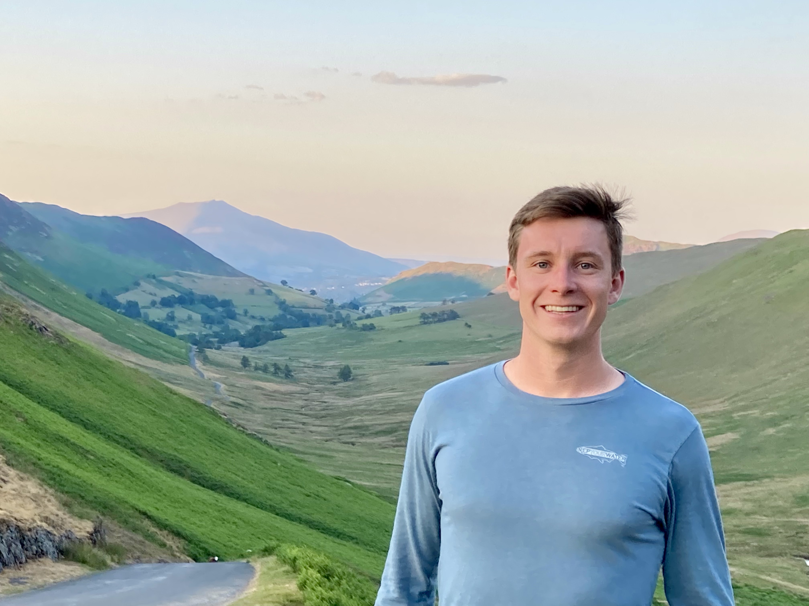
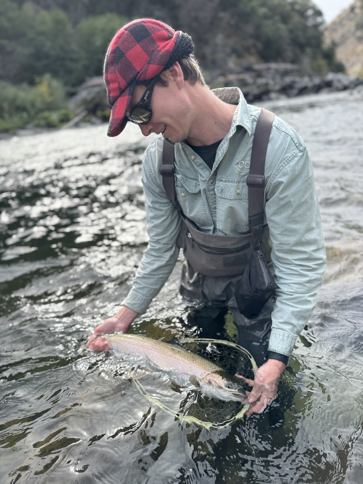

# About me

I'm a third PhD student in the [Institute for Computational and Mathematical Engineering](https://icme.stanford.edu/) at Stanford University. I am coadvised by [Noah Rosenberg](https://rosenberglab.stanford.edu/) and [Ben Good](https://bgoodlab.github.io/). My current research focuses on **statistics of phylogenetic tree shape** and **population genetics in metapopulations**. 

You can find out more about my [research](publications.md) and read my [blog](blog/index.md), where I write about mathematics, some adventures in nature, and more! For fun, I enjoy backpacking, fly fishing, looking for salamanders and more. 

You can contact me best by email: [djbauman@stanford.edu](mailto:djbauman@stanford.edu)

